# Vive Medellín API (Spring Boot + PostgreSQL + JWT)

Backend en Spring Boot 3 (Java 17) con autenticación JWT, PostgreSQL y JPA/Hibernate. Actualmente Flyway está deshabilitado y el esquema se gestiona con Hibernate (create-drop).

## Stack
- Java 17+, Spring Boot 3, Maven
- Spring Web, Spring Data JPA, Spring Security, Validation
- PostgreSQL
- JJWT (HS256)
- Lombok (requiere annotation processing en el IDE)
- Actuator (health)

## Requisitos
- Java (JDK) 17+
- Maven 3.9+
- Docker (para DB local) o una instancia de PostgreSQL

## Arranque rápido
1) Base de datos con Docker Compose:
```zsh
cd /Users/yiyi/viveMedellin/api
# Si ves un warning por 'version:' es inocuo en Compose v2
docker compose up -d
docker compose ps
```

2) Ejecutar la app (Maven):
```zsh
cd /Users/yiyi/viveMedellin/api
export DB_URL=jdbc:postgresql://localhost:5432/eventos
export DB_USER=eventos
export DB_PASS=eventos
# Recomendado: definir una clave JWT robusta
export JWT_SECRET=$(python3 - <<'PY'
import secrets; print(secrets.token_urlsafe(64))
PY
)

mvn -DskipTests spring-boot:run
```

3) Verificar salud:
```zsh
curl -fsS http://localhost:8080/actuator/health
# {"status":"UP"}
```

## Configuración (application.yml)
- JPA/Hibernate: `ddl-auto: create-drop` (crea y elimina el esquema al iniciar/detener la app)
- Flyway: `enabled: false`
- Dialect: `org.hibernate.dialect.PostgreSQLDialect`
- Variables de entorno soportadas:
  - DB_URL (por defecto `jdbc:postgresql://localhost:5432/eventos`)
  - DB_USER (por defecto `eventos`)
  - DB_PASS (por defecto `eventos`)
  - JWT_SECRET (por defecto `changeme`; cambiar fuera de local)
  - CORS_ALLOWED_ORIGINS (por defecto `http://localhost:5173`)

## Ejecutar con JAR
```zsh
cd /Users/yiyi/viveMedellin/api
mvn -DskipTests clean package
java -jar target/eventos-0.0.1-SNAPSHOT.jar
```
Cambiar puerto:
```zsh
mvn -DskipTests spring-boot:run -Dspring-boot.run.arguments=--server.port=8081
```

## Endpoints
- Health (libre):
  - `GET /actuator/health` → `{ "status": "UP" }`

- Auth (libres):
  - `POST /api/auth/signup` → 200 sin cuerpo (crea usuario)
    - Body: `{ "name", "username", "email", "password" }`
  - `POST /api/auth/login` → 200 `{ accessToken, refreshToken, user }`
    - Body: `{ "username", "password" }`
  - `POST /api/auth/refresh` → 200 con nuevo `accessToken`
    - Body: `{ "refreshToken" }`
  - `GET /api/auth/allUsers` → lista de usuarios

- Events (ACTUALMENTE públicos según SecurityConfig):
  - `GET /api/events?page=0&size=10` → lista de `EventSummaryDto`
  - `GET /api/events/{id}` → `EventDto`
  - `POST /api/events/save` → crea evento a partir de `EventDto`
  - `PUT /api/events/update` → actualiza y devuelve `EventDto`
  - `DELETE /api/events/{id}` → 204 sin contenido
  - `GET /api/events/user/{userId}` → lista de `EventDto` del usuario

> Nota: si se desea proteger los endpoints de eventos, actualizar `SecurityConfig` para exigir autenticación (quitar `permitAll()` en `/api/events/**`).

## Ejemplos (curl)
Signup (200 sin cuerpo):
```zsh
curl -i -X POST http://localhost:8080/api/auth/signup \
  -H 'Content-Type: application/json' \
  -d '{"name":"Demo","username":"demo","email":"demo@local","password":"Demo123!"}'
```

Login y usar token:
```zsh
TOKEN=$(curl -s -X POST http://localhost:8080/api/auth/login \
  -H 'Content-Type: application/json' \
  -d '{"username":"demo","password":"Demo123!"}' | \
  python3 -c 'import sys, json; print(json.load(sys.stdin)["accessToken"])')

# Si proteges eventos en el futuro:
curl -s http://localhost:8080/api/events -H "Authorization: Bearer $TOKEN"
```

## Troubleshooting
- Puerto 8080 en uso:
```zsh
lsof -ti tcp:8080 | xargs kill -9
```
- Docker Compose: ejecuta desde `api/` o usa `-f /ruta/al/docker-compose.yml`.
- DB inaccesible: revisa `docker compose ps`, credenciales y `DB_URL`.
- 403 en endpoints protegidos: falta `Authorization: Bearer <accessToken>` o token inválido.

## Arquitectura y Diseño

### Diagrama de Clases - Interacción Social y Comunitaria

La aplicación está diseñada para evolucionar hacia un sistema de interacción social completo. El siguiente diagrama muestra tanto el estado actual como las extensiones planificadas:

#### Estado Actual del Sistema

```mermaid
classDiagram
    %% === MODELO DE DOMINIO ACTUAL ===
    class User {
        -Long id
        -String name
        -String username
        -String email
        -String passwordHash
        -String role
        -Boolean isActive
        -LocalDateTime createdAt
        -LocalDateTime updatedAt
        +getAuthorities() Collection~GrantedAuthority~
        +Builder builder()
    }

    class Event {
        -Long id
        -String title
        -String description
        -LocalDateTime startsAt
        -LocalDateTime endsAt
        -String locationText
        -String imageUrl
        -Long createdBy
        -Boolean isActive
        -LocalDateTime createdAt
        -LocalDateTime updatedAt
    }

    class Comment {
        -Long id
        -String content
        -boolean deleted
        -LocalDateTime createdAt
        -LocalDateTime updatedAt
        -Long author
        -Long event
        -Comment parent
        -List~Comment~ replies
    }

    %% === CAPA DE SERVICIO ACTUAL ===
    class UserService {
        -UserRepository userRepository
        -PasswordEncoder passwordEncoder
        +loadUserByUsername(String) UserDetails
        +createUser(SignupRequest) User
        +findByUsername(String) Optional~User~
    }

    class EventService {
        -EventRepository eventRepository
        +createEvent(EventDto) Event
        +getEvents() List~Event~
        +getEventById(Long) Event
        +updateEvent(Long, EventDto) Event
        +deleteEvent(Long) void
    }

    class CommentService {
        -CommentRepository commentRepository
        +getCommentsByEvent(Long) List~CommentDto~
        +createComment(CommentDto) CommentDto
        +updateComment(Long, CommentDto) CommentDto
        +deleteComment(Long) void
    }

    %% === CONTROLADORES ACTUALES ===
    class AuthController {
        -UserService userService
        -JwtService jwtService
        +signup(SignupRequest) ResponseEntity
        +login(LoginRequest) ResponseEntity
        +refresh(RefreshRequest) ResponseEntity
    }

    class EventController {
        -EventService eventService
        +createEvent(EventDto) ResponseEntity
        +getEvents() List~EventDto~
        +getEvent(Long) EventDto
        +updateEvent(Long, EventDto) EventDto
        +deleteEvent(Long) void
    }

    class CommentController {
        -CommentService commentService
        +getCommentsByEvent(Long) List~CommentDto~
        +createComment(CommentDto) CommentDto
        +updateComment(Long, CommentDto) CommentDto
        +deleteComment(Long) void
    }

    %% Relaciones actuales
    User ||--o{ Event : creates
    Event ||--o{ Comment : has
    User ||--o{ Comment : writes
    Comment ||--o{ Comment : replies_to

    UserService --> UserRepository
    EventService --> EventRepository
    CommentService --> CommentRepository

    AuthController --> UserService
    AuthController --> JwtService
    EventController --> EventService
    CommentController --> CommentService
```

#### Funcionalidades de Interacción Social Planificadas

**🎯 Feature 3: Interacción Social y Comunitaria**

Las siguientes funcionalidades están planificadas para implementación:

1. **✅ Autenticación y Autorización** - *(Implementado)*
   - JWT con Spring Security
   - Sistema de roles básico

2. **✅ Crear y Consultar Comentarios** - *(Implementado)*
   - Comentarios en eventos
   - Estructura jerárquica (respuestas)

3. **🚀 Extensiones Planificadas:**
   - **Sistema de Seguimiento**: Seguir usuarios con intereses similares
   - **Moderación Avanzada**: Eliminar comentarios (propios/admin)
   - **Notificaciones**: Nuevos comentarios en eventos guardados
   - **Dashboard Social**: Eventos más comentados y usuarios activos
   - **Compartir Eventos**: Funcionalidad social de compartir

#### Arquitectura Extendida (Planificada)

```mermaid
classDiagram
    %% === NUEVAS ENTIDADES PARA INTERACCIÓN SOCIAL ===
    class UserFollow {
        -Long id
        -User follower
        -User followed
        -LocalDateTime createdAt
        -boolean isActive
    }

    class EventSaved {
        -Long id
        -User user
        -Event event
        -LocalDateTime savedAt
    }

    class Notification {
        <<abstract>>
        -Long id
        -User recipient
        -String message
        -NotificationType type
        -boolean isRead
        -LocalDateTime createdAt
        +markAsRead() void
    }

    class CommentNotification {
        -Comment comment
        -Comment parentComment
        -NotificationTrigger trigger
    }

    class SocialActivitySummary {
        -Long id
        -LocalDate date
        -List~Event~ mostCommentedEvents
        -List~User~ mostActiveUsers
        -Map~String, Integer~ activityMetrics
    }

    %% === INTERFACES (PRINCIPIOS SOLID) ===
    class INotificationService {
        <<interface>>
        +sendNotification(Notification) void
        +getUnreadNotifications(User) List~Notification~
    }

    class IUserInteractionService {
        <<interface>>
        +followUser(User, User) UserFollow
        +saveEvent(User, Event) EventSaved
        +getFollowers(User) List~User~
    }

    class ISocialActivityService {
        <<interface>>
        +generateDailyActivitySummary() SocialActivitySummary
        +getMostCommentedEvents(int) List~Event~
        +getMostActiveUsers(int) List~User~
    }

    %% === SERVICIOS EXTENDIDOS ===
    class NotificationService {
        +createCommentNotification(Comment, User) void
        +sendNotificationToEventSavers(Event, Comment) void
        +getUnreadNotifications(User) List~Notification~
    }

    class UserInteractionService {
        +followUser(User, User) UserFollow
        +saveEvent(User, Event) EventSaved
        +isFollowing(User, User) boolean
    }

    class SocialActivityService {
        +generateDailyActivitySummary() SocialActivitySummary
        +getMostActiveUsersInPeriod(LocalDate, LocalDate) List~User~
    }

    %% === NUEVO CONTROLADOR ===
    class SocialController {
        +followUser(Long) ResponseEntity
        +saveEvent(Long) ResponseEntity
        +getNotifications() List~NotificationDto~
        +getSocialActivityDashboard() SocialActivitySummaryDto
    }

    %% Relaciones planificadas
    User ||--o{ UserFollow : follower
    User ||--o{ UserFollow : followed
    User ||--o{ EventSaved : saves
    Event ||--o{ EventSaved : saved_by
    User ||--o{ Notification : receives
    Comment ||--o{ CommentNotification : triggers
```

#### Consideraciones de Seguridad y Accesibilidad

- **🔐 Seguridad**: Autorización granular, validación de entrada, auditoría
- **♿ Accesibilidad**: DTOs con metadatos UI, estructura semántica
- **📊 Monitoreo**: Métricas de actividad y dashboards administrativos

### Diagrama de Componentes y Paquetes

#### Estructura Actual de Paquetes


#### Arquitectura Extendida Planificada


### Estilo Arquitectónico del Sistema

#### 🏗️ **Arquitectura Monolítica Modular**

**Estado Actual: MONOLITO**

```mermaid
graph TD
    subgraph "VIVE MEDELLÍN - MONOLITHIC APPLICATION"
        subgraph "Single Deployable Unit"
            direction TB
            UI[Web UI / Mobile App]
            API[REST API Layer]
            BUSINESS[Business Logic Layer]
            DATA[Data Access Layer]
            DB[(Single Database)]
        end
        
        subgraph "Deployment"
            JAR[Single JAR File]
            SERVER[Application Server]
            CONTAINER[Docker Container]
        end
    end
    
    UI --> API
    API --> BUSINESS
    BUSINESS --> DATA
    DATA --> DB
    
    JAR --> SERVER
    SERVER --> CONTAINER
    
    classDef monolith fill:#e3f2fd,stroke:#1976d2,stroke-width:2px
    classDef deployment fill:#f3e5f5,stroke:#7b1fa2,stroke-width:2px
    
    class UI,API,BUSINESS,DATA,DB monolith
    class JAR,SERVER,CONTAINER deployment
```



#### 📊 **Análisis del Estilo Arquitectónico Actual**

| Aspecto | Monolito Actual | Estado |
|---------|-----------------|--------|
| **Deployment** | Una sola unidad desplegable (JAR) | ✅ Implementado |
| **Base de Datos** | Una sola instancia PostgreSQL | ✅ Implementado |
| **Comunicación** | Llamadas de métodos internos | ✅ Implementado |
| **Tecnología** | Stack unificado (Spring Boot) | ✅ Implementado |
| **Escalabilidad** | Vertical (más recursos al servidor) | ✅ Actual |
| **Desarrollo** | Equipo trabajando en misma base código | ✅ Actual |
